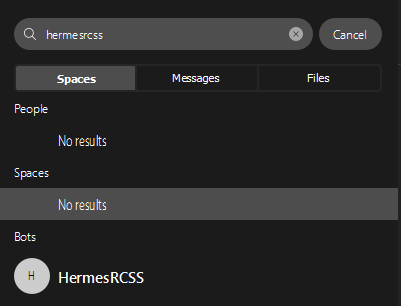
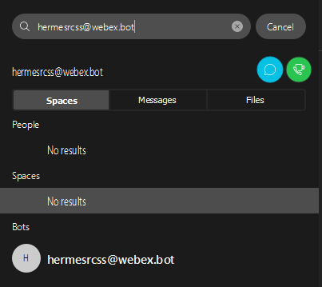

# HermesRCSS

HermesRCSS is a notification bot intended to message you via the [Webex Teams](https://teams.webex.com) messaging client.

<!-- ## Installation

Use the package manager [pip](https://pip.pypa.io/en/stable/) to install foobar.

```bash
pip install foobar
``` -->

## Usage

- Log in to Webex Teams 
    - Via web at https://teams.webex.com
    - Via the app https://www.webex.com/downloads.html
- Search for the bot on the search bar
    - By name:
    - 
    - By url:
    - 
- Click on the bot to start a space with it.
- Send the command "/subscribe" to get added to the list.

## Contributing
Pull requests are welcome. For major changes, please open an issue first to discuss what you would like to change.

Please make sure to update tests as appropriate.

## License
[GNU GPLv3](https://choosealicense.com/licenses/gpl-3.0/)